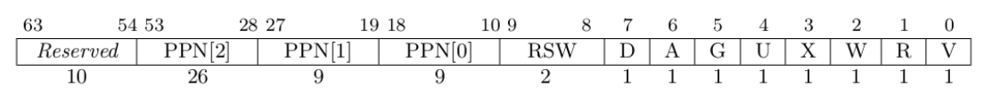
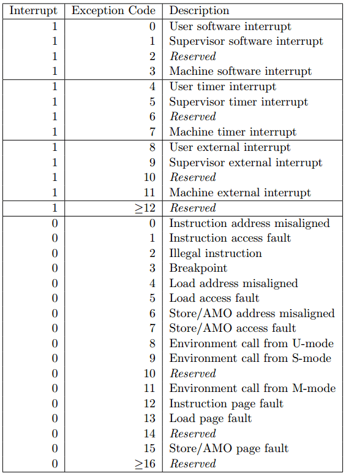

1. 在完成本次实验的过程（含此前学习的过程）中，我曾分别与 以下各位 就（与本次实验相关的）以下方面做过交流，还在代码中对应的位置以注释形式记录了具体的交流对象及内容：

2. 此外，我也参考了 以下资料 ，还在代码中对应的位置以注释形式记录了具体的参考来源及内容：

3. 我独立完成了本次实验除以上方面之外的所有工作，包括代码与文档。 我清楚地知道，从以上方面获得的信息在一定程度上降低了实验难度，可能会影响起评分。

4. 我从未使用过他人的代码，不管是原封不动地复制，还是经过了某些等价转换。 我未曾也不会向他人（含此后各届同学）复制或公开我的实验代码，我有义务妥善保管好它们。 我提交至本实验的评测系统的代码，均无意于破坏或妨碍任何计算机系统的正常运转。 我清楚地知道，以上情况均为本课程纪律所禁止，若违反，对应的实验成绩将按“-100”分计。

### 编程作业

    为了将用户空间的虚拟地址转换到物理地址（即内核空间的虚拟地址），我在mm/page_table.rs中添加了函数translated_physaddr，继而根据该函数重写了 sys_get_time 和 sys_task_info。

    mmap的实现主要是两点，一个是检查要映射虚拟地址空间是否全部没有映射，为此我在mm/page_table.rs中添加了check_no_mapped函数。第二点是需要完成映射，该工作需要修改task的页表，因此我将该工作交由TASK_MANAGER完成，所以在task/mod.rs中添加了mmap_current_task函数。

    munmap是mmap的逆过程，因此我在mm/page_table.rs中添加了check_all_mapped函数，以此检查该虚拟地址空间是否全部映射。另外就是在task/mod.rs中添加了unmap_current_task函数，值得一提的是，unmap时还需要删除memory_set.areas中对于的MapArea，原来的代码没有实现相应的功能，因此我为MemorySet结构实现了delete_framed_area方法以实现该功能。

### 简答作业

1. 请列举 SV39 页表页表项的组成，描述其中的标志位有何作用？
    
    
    上图为 SV39 分页模式下的页表项，其中 [53:10] 这44位是物理页号，最低的 8位 [7:0] 则是标志位，它们的含义如下
    
    仅当 V(Valid) 位为 1 时，页表项才是合法的
    
    R/W/X 分别控制索引到这个页表项的对应虚拟页面是否允许读/写/取指
    
    U 控制索引到这个页表项的对应虚拟页面是否在 CPU 处于 U 特权级的情况下是否被允许访问
    
    A(Accessed) 记录自从页表项上的这一位被清零之后，页表项的对应虚拟页面是否被访问过
    
    D(Dirty) 则记录自从页表项上的这一位被清零之后，页表项的对应虚拟页表是否被修改过

2. 缺页
    
    缺页指的是进程访问页面时页面不在页表中或在页表中无效的现象，此时 MMU 将会返回一个中断， 告知 os 进程内存访问出了问题。os 选择填补页表并重新执行异常指令或者杀死进程。

    请问哪些异常可能是缺页导致的？

        对非法页面的一切操作、用户操作非用户页面（没有U标记），读写或执行没有对应权限的页面
    
    发生缺页时，描述相关重要寄存器的值，上次实验描述过的可以简略

    

        该图展示了Risc-V的各种异常原因，在S态主要与sepc、stval、sstatus、scause 这几个个寄存器有关，前三个寄存器在上一章的文档中有介绍，这里不再阐述，其中scause这个寄存器保存了进入异常的原因，即上图显示的信息，其中与缺页有关的有 5、7、12、13、15
    
    缺页有两个常见的原因，其一是 Lazy 策略，也就是直到内存页面被访问才实际进行页表操作。 比如，一个程序被执行时，进程的代码段理论上需要从磁盘加载到内存。但是 os 并不会马上这样做， 而是会保存 .text 段在磁盘的位置信息，在这些代码第一次被执行时才完成从磁盘的加载操作。

    这样做有哪些好处？

        很多时候，我们不会访问到程序中所有的流程，比如异常处理的流程，这些代码片段可能在整个程序的执行期间内都不会执行到，将它们载入内存是对内存资源的浪费。另外，有的时候程序刚启动就被替换了，比如fork之后接exec，如果我们等到程序执行到时再将其载入内存，能大大提高程序执行的性能。

    其实，我们的 mmap 也可以采取 Lazy 策略，比如：一个用户进程先后申请了 10G 的内存空间， 然后用了其中 1M 就直接退出了。按照现在的做法，我们显然亏大了，进行了很多没有意义的页表操作。

    处理 10G 连续的内存页面，对应的 SV39 页表大致占用多少内存 (估算数量级即可)

        一个一级页表能映射512个二级页表，一个二级页表能映射512个三级页表，一个三级页表能映射512个物理页，10G内存是2.5M物理页，需要5K三级页表，10个二级页表，1个一级页表，大致占用20M内存（主要是三级页表的数量）
    
    请简单思考如何才能实现 Lazy 策略，缺页时又如何处理？描述合理即可，不需要考虑实现。

        在初始化页表时可以初始化权限但不分配实际物理空间，即V标志未0，等到发生缺页中断后根据中断的原因判断，如果有权限但V为0则此时分配物理页并置V为1，如果没有对应权限说明这确实是非法访问，直接报错并杀死进程即可

    缺页的另一个常见原因是 swap 策略，也就是内存页面可能被换到磁盘上了，导致对应页面失效。

    此时页面失效如何表现在页表项(PTE)上？

        可以考虑使用PTE中保留的标志，为其添加SWAP标志即可

3. 双页表与单页表

    为了防范侧信道攻击，我们的 os 使用了双页表。但是传统的设计一直是单页表的，也就是说， 用户线程和对应的内核线程共用同一张页表，只不过内核对应的地址只允许在内核态访问。 (备注：这里的单/双的说法仅为自创的通俗说法，并无这个名词概念，详情见 [KPTI](https://en.wikipedia.org/wiki/Kernel_page-table_isolation)

    在单页表情况下，如何更换页表？

        在单页表下，每个进程都需要映射内核空间，因此直接在内核空间更换页表即可，更换前后不会导致运行流程改变

    单页表情况下，如何控制用户态无法访问内核页面？（tips:看看上一题最后一问）

        使用PET中的U标志为即可，用户态只能访问U标志为1的页

    单页表有何优势

        最大的优势就是不切换进程时无需切换页表，减少了Trap的开销，另外Trap时无需刷新快表能最大程度利用快表对访存性能的提升

    双页表实现下，何时需要更换页表？假设你写一个单页表操作系统，你会选择何时更换页表（回答合理即可）？

        双页表实现下，每次进入Trap和退出Trap时需要切换页表（如果切换了进程，Trap前后的页表会不同，但无论是否切换进程，一次Trap都需要切换两次页表）。
        单页表实现在切换进程时切换页表
    

    

